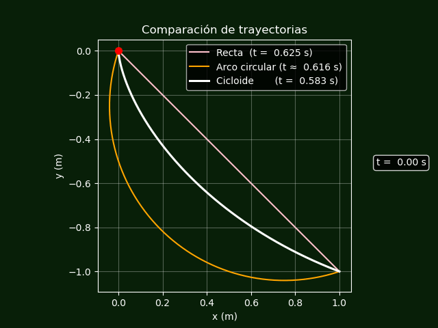

# braquistocrona_app
## -  Qué es esto? 
Aplicación interactiva en Python + Streamlit para la simulación del problema de la braquistócrona. La app compara el tiempo de caída de una partícula desde A(Ax,Ay) hasta B(Bx,By) a lo largo de tres trayectorias posibles: una recta, un arco circular y una cicloide invertida (braquistócrona).
El sistema valida automáticamente si los puntos dados admiten una braquistócrona y muestra la animación del movimiento en cada curva.
## -  Qué hace? 
* Tiene controles interactivos (sliders) con Streamlit para las coordenadas de los puntos A y 𝐵.
* Calcula y grafica una recta, un arco circular y una cicloide invertida para los puntos ingresados.
* Muestra la animación del avance de la partícula en cada trayectoria.
* Reporta el tiempo en cada trayecto.
## -  Cómo lo instalo? 
Para instalarlo solo debes clonar el repositorio e instalar las dependencias. Usa: 
```
git clone https://github.com/barbi-dev/braquistocrona_app.git
cd braquistocrona_app
pip install -r requirements.txt
```
## - Cómo lo uso? 
Una vez instalado el repo, ejecuta: `streamlit run braquistocrona_app.py`
### - Ejemplo Visual


## - Un poco de matemática
El tiempo de caída de una trayectoria $y(x)$ bajo la acción de la gravedad está dado por el funcional:

$$
T[y] = \int \tfrac{\sqrt{1 + (y´(x))^2}}{\sqrt{2g(y_0 - y(x))}} \mathrm{d}x
$$

El problema consiste en minimizar este tiempo mediante cálculo de variaciones.
La curva que resuelve este problema es la **cicloide invertida**, cuya ecuación paramétrica es:

$$
x(\theta) = x_0 + a(\theta - \sin\theta) \qquad
y(\theta) = y_0 - a(1 - \cos\theta)
$$

donde $a$ es un parámetro relacionado con la escala de la cicloide y $\theta$ es el parámetro angular.


